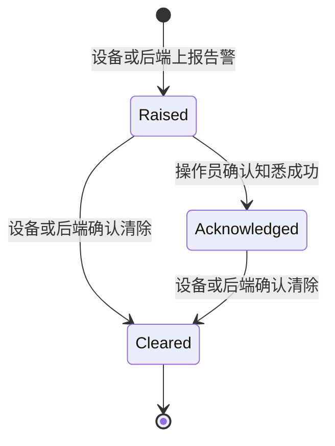

# 设备错误与状态反馈 UI：生产实施与 Codex 交接指南

> 文档状态：可用于研发交接与生产实现拆分  
> 视觉基准：WT32 本地开发页 `/dev/feedback-showcase` 在浏览器中的实际渲染  
> 适用范围：设备告警、阻断错误、页面内错误、任务状态和影像视口加载错误  
> 最后更新：2026-07-15

## 1. 结论先行

生产实现应沿用当前浏览器预览中的视觉方向，并统一遵守以下产品规则：

1. 操作员界面不显示“严重错误”“Fatal”“Critical error”等严重度文字。阻断弹窗直接显示具体问题标题，例如“设备通信链路中断”，右侧显示中性的错误码标签。
2. 操作员界面不提供“清除测试告警”或任何等价入口。测试注入和测试清除只能存在于隔离的测试工具、服务模式或后端测试接口中，不能进入生产构建的常规操作界面。
3. “确认知悉”仅代表当前用户已看到该告警，不代表故障已经清除、设备已经恢复或操作可以继续。
4. 告警只能由设备状态或后端权威状态转为 `cleared`。收到清除事件后，前端才从活动告警列表中移除。
5. 红色仅用于阻断弹窗顶部强调线、图标和主操作按钮等少量重点位置；大面积信息区保持白色、浅灰色，降低恐慌感并提高可读性。
6. 生产界面以浏览器实际 DOM/CSS 渲染为验收基准。聊天中生成或粘贴的效果图仅用于沟通，不作为像素级验收依据。

当前 WT32 是产品和 UI 验证原型，不是临床软件，也不具备真实设备控制、安全保证或法规合规证明。本指南可作为下游生产项目的 UI 与软件工程输入，但如果要连接真实设备，还必须单独完成设备厂商接口确认、风险分析、网络安全、可用性工程、验证确认和适用法规流程。

## 2. 目标与非目标

### 2.1 目标

- 建立一套统一的错误与状态反馈视觉语言。
- 明确普通错误、设备警告、阻断设备错误、任务状态和视口错误的使用边界。
- 建立前端、后端和设备协议之间可追踪、可恢复、可审计的告警状态流。
- 让研发同事可以将本文直接交给 Codex，按可验证的小步骤完成生产实现。
- 保证 1024 × 768 触控控制台内的信息层级、触控尺寸和遮挡关系可接受。

### 2.2 非目标

- 本文不定义真实设备如何恢复、复位、重新连接或继续扫描。
- 本文不判断某个故障是否已经安全消除。
- 本文不替代设备厂商协议、风险控制措施、危害分析或法规验证资料。
- 本文不授权前端通过“确认知悉”触发任何恢复、复位或清除指令。
- 本文不要求把所有日志、堆栈或原始协议报文展示给普通操作员。

## 3. 最终产品决策

### 3.1 阻断设备错误

阻断弹窗按以下顺序呈现：

1. 图标。
2. 具体问题标题，例如“设备通信链路中断”。
3. 中性错误码标签，例如 `0x02010003`。
4. 结构化详情：所属模块、来源、技术说明、参考处理。
5. 提醒文案：“通信告警信息仅供状态核对；任何恢复操作均需要确认。”
6. 唯一操作：“确认知悉”。

禁止在此区域出现：

- “严重错误”“致命错误”“Fatal”“Critical error”等严重度标签。
- “一切安全”“已经恢复”“可继续操作”等未经权威状态确认的结论。
- “清除测试告警”“忽略并继续”“强制恢复”等动作。
- 未过滤的异常堆栈、内部路径、数据库信息或设备原始报文。

内部仍可保留 `fatal`、`error`、`warning` 等严重度字段，用于排序、阻断策略、日志级别和告警路由；该字段不能直接转成面向操作员的严重度文字。

### 3.2 设备警告

- 使用顶部 Banner，不遮挡主要任务信息。
- 标题可显示“设备警告 · 错误码”，正文显示经过审核的简短描述。
- 提供“确认知悉”，确认后从前景 Banner 收起，但仍保留在活动告警记录中，直至收到 `cleared`。
- 紧急会话或其他系统级顶部提示存在时，Banner 必须下移，不能相互覆盖。

### 3.3 页面内普通错误

- 保存失败、登录失败、数据加载失败等页面级错误使用 Inline Notice。
- 必须说明发生了什么，以及用户可以采取的下一步。
- 错误靠近其所属表单或内容区域显示，避免统一弹窗打断。

### 3.4 任务状态

- 进行中使用蓝色 `info`。
- 完成使用绿色 `success`。
- 不用红色表达正常的等待、进行或完成状态。
- “完成”“已关联”“已恢复”等结果文案必须来自已确认的后端状态，不能仅由前端计时或点击推断。

### 3.5 影像视口错误

- 影像无法加载或渲染失败时，在对应视口内部显示深色 Overlay。
- Overlay 不扩散到整个应用，除非该错误确实阻断整个工作流。
- 标题说明问题，正文提供可执行且不承诺成功的建议，例如“请检查网络后重试”。

## 4. 统一组件与使用矩阵

| 场景 | 组件形态 | 语义色 | 是否阻断 | 主操作 | 生命周期 |
| --- | --- | --- | --- | --- | --- |
| 表单保存失败、登录失败 | Inline Notice | error | 否 | 按页面需要提供重试 | 当前页面状态消失后移除 |
| 设备警告 | Top Banner | warning | 通常否 | 确认知悉 | `cleared` 后移除 |
| 任务进行中 | Inline Notice | info | 否 | 通常无 | 后端状态变化后更新 |
| 任务完成 | Inline Notice | success | 否 | 通常无 | 按业务周期收起 |
| 单个影像视口失败 | Viewport Overlay | error | 仅阻断该视口 | 可选重试 | 视口恢复后移除 |
| 设备错误阻断当前流程 | Blocking Dialog | 内部 error/fatal | 是 | 确认知悉 | 确认后收起；`cleared` 后移除 |
| 已知悉但未清除的告警 | Active Alerts Panel | 按内部严重度排序 | 否或由工作流另行决定 | 查看详情 | `cleared` 后移除 |

生产代码建议保留以下分层，而不是让每个页面自行拼样式：

```text
Feedback primitives
├── FeedbackNotice
├── FeedbackViewportOverlay
├── DeviceWarningBanner
├── DeviceBlockingDialog
└── ActiveDeviceAlertsPanel

Device alarm domain
├── DeviceAlarmClient        WebSocket/SSE、重连、重放
├── DeviceAlarmStore         归并、排序、状态机
├── DeviceAlarmCatalog       审核后的标题与处理说明
└── DeviceAlarmAuditClient   确认、失败反馈、审计
```

## 5. 视觉规格

### 5.1 颜色令牌

当前浏览器预览使用以下令牌，可作为生产设计系统的初始值。生产项目应将其收敛为语义 Token，禁止业务页面复制十六进制颜色。

| 语义 | 边框 | 背景 | 主文字/图标 |
| --- | --- | --- | --- |
| info | `#BBDEFB` | `#F4F9FF` | `#1565C0` / `#1976D2` |
| success | `#C8E6C9` | `#F1F8F2` | `#2E7D32` |
| warning | `#F59E0B` | `#FFFBEB` | `#92400E` / `#D97706` |
| error | `#FCA5A5` | `#FEF2F2` | `#B91C1C` / `#DC2626` |
| blocking accent | `#991B1B` 或 `#B91C1C` | 主体白色 | 仅用于顶部线、图标、确认按钮 |
| neutral content | `#E2E8F0` | `#F8FAFC` | `#334155` / `#64748B` |

### 5.2 尺寸与布局

- 基准控制台：1024 × 768。
- 阻断弹窗：宽 560 px，圆角 12 px，顶部强调线 4 px，内边距 24 px。
- 阻断图标容器：44 × 44 px。
- 主标题：18 px、粗体；错误码：11 px、等宽字体、中性灰色标签。
- 详情区：浅灰背景、1 px 边框、16 px 内边距；标签列约 88 px。
- “确认知悉”按钮：高 40 px，横向内边距 20 px。
- 警告 Banner：宽 720 px；正常距顶部 12 px，存在顶部系统提示时下移至约 56 px。
- 活动告警面板：宽 660 px；左侧列表 210 px；列表最大高度 360 px。
- Inline Notice：紧凑型内边距 `12 × 8 px`，普通型 `16 × 12 px`，正文 12 px。
- 视口 Overlay：限制在视口容器内部；背景 `#0F172A`、约 95% 不透明度。

### 5.3 视觉约束

- 不用大面积纯红背景，不使用闪烁动画。
- 不通过颜色单独表达状态；同时提供图标、标题和结构化内容。
- 错误码不能抢过问题标题的视觉层级。
- 文本必须允许换行；中文、英文和较长错误码都不能把按钮挤出弹窗。
- 生产验收使用目标浏览器、目标缩放比例和目标字体渲染截图对比。
- `/dev/feedback-showcase` 仅为开发预览路由，生产构建不得暴露该路由或 `DEV ONLY` 标识。

## 6. 告警状态机



状态含义：

- `raised`：告警活动中。根据策略显示 Banner、阻断弹窗或活动告警入口。
- `acknowledged`：当前告警实例已被指定用户确认。它仍然是活动告警，不能当作已恢复。
- `cleared`：后端已从设备权威状态确认该告警实例不再活动，前端可以移除。

必须支持 `raised → cleared`，因为设备可能在用户确认前自行恢复。禁止由前端构造 `cleared` 事件。

同一错误码在不同设备、不同告警实例或不同时间重复发生时，必须视为不同实例。不能像原型一样只按 `error.code` 去重。

## 7. 生产事件契约

当前 WT32 原型事件可帮助理解流程，但生产实现应使用版本化、可重放、可审计的契约。建议最小字段如下：

```ts
type DeviceAlarmState = "raised" | "acknowledged" | "cleared";
type DeviceAlarmSeverity = "fatal" | "error" | "warning"; // 仅内部策略使用

type DeviceAlarmEventV1 = {
  schema_version: "1.0";
  event_type: "device_alarm";
  event_id: string;            // 本次事件唯一 ID，用于幂等
  alarm_instance_id: string;   // 一次 raised 到 cleared 的稳定实例 ID
  device_id: string;
  sequence: number;            // 设备或服务端单调递增序号
  occurred_at: string;         // ISO 8601，含时区
  received_at: string;         // 服务端接收时间
  state: DeviceAlarmState;
  code: string;
  severity: DeviceAlarmSeverity;
  module_key: string;
  message_key: string;
  message_params: Record<string, string | number>;
  technical_detail_key?: string;
  reference_action_key?: string;
  source: "command_response" | "status_report" | "hardware_detail" | "history";
  scan_session_id?: string;
  acknowledged_by?: string;
  acknowledged_at?: string;
  catalog_version: string;
};
```

示例：

```json
{
  "schema_version": "1.0",
  "event_type": "device_alarm",
  "event_id": "evt_01K0...",
  "alarm_instance_id": "alarm_01K0...",
  "device_id": "console-device-01",
  "sequence": 1842,
  "occurred_at": "2026-07-15T09:20:31.514+08:00",
  "received_at": "2026-07-15T09:20:31.602+08:00",
  "state": "raised",
  "code": "0x02010003",
  "severity": "fatal",
  "module_key": "communication_control",
  "message_key": "device_alarm.communication_link_interrupted",
  "message_params": {},
  "technical_detail_key": "device_alarm.check_connection_state",
  "reference_action_key": "device_alarm.recovery_requires_confirmation",
  "source": "status_report",
  "scan_session_id": "session_123",
  "catalog_version": "2026.07.1"
}
```

契约要求：

- `event_id` 用于事件去重，`alarm_instance_id` 用于告警生命周期归并；两者不能混用。
- 服务端必须校验状态迁移、设备归属和用户权限。
- 事件顺序由 `sequence` 和服务端时间共同判断，不能只依赖客户端到达顺序。
- 未知字段向前兼容；缺少必填字段、非法状态或不支持的版本必须进入遥测并安全忽略。
- 普通操作员文案来自受控目录的 `message_key`，不能直接展示设备提供的任意字符串。
- 原始协议载荷可以进入受权限保护的诊断日志，但不能随事件完整下发给普通前端。
- 多语言由受控文案目录负责；错误码保持原样，不能翻译。

## 8. 前端生产实现要求

### 8.1 连接与同步

1. 只有已认证、具备相应权限的应用壳层才建立告警连接；登录页不连接、不显示设备告警。
2. 首次连接先获取活动告警快照，再订阅增量事件，避免页面刷新后丢失活动告警。
3. 断线重连使用指数退避和随机抖动，并设置上限；不能固定每 2 秒永久重连。
4. 重连后携带最后确认的 `sequence` 或游标进行重放；无法重放时重新获取完整快照。
5. 连接断开时显示独立的“设备状态连接中断”提示。此提示不能伪装成某个设备故障，也不能声称设备已经停止或安全。
6. 页面后台恢复、网络切换和用户重新认证后都要执行状态校准。

### 8.2 Store 与派生状态

- Store 主键使用 `(device_id, alarm_instance_id)`。
- 同一 `event_id` 重复到达时保持幂等。
- 旧 `sequence` 不覆盖新状态。
- 活动告警排序建议为：未确认阻断 > 未确认警告 > 已确认未清除；同级按发生时间倒序。
- 同时存在多个阻断告警时，弹窗显示优先级最高的一条，并提供“还有 N 条活动告警”的明确入口。
- 所有派生 UI 状态都可以通过快照重建，不能依赖仅存在于某个组件内的临时状态。

### 8.3 确认知悉

建议使用独立、幂等的服务端命令：

```http
POST /api/device-alarms/{alarm_instance_id}/acknowledgements
Idempotency-Key: <uuid>
```

前端交互：

1. 点击后按钮进入“提交中”并防止重复点击。
2. 服务端确认成功后，将该告警显示为已知悉并关闭阻断层。
3. 请求失败时保持告警可见，展示“确认未提交，请重试”，不能乐观地永久隐藏。
4. 服务端返回告警已清除时，按 `cleared` 处理。
5. 审计信息至少包含用户、角色、设备、告警实例、时间、客户端版本和请求 ID。

### 8.4 Schema 校验

生产前端必须使用完整运行时 Schema 校验，而不是只判断 `event`、`code`、`message` 等少数字段。推荐复用 OpenAPI/JSON Schema 生成类型与校验器，并为不支持版本建立可观测的安全降级。

### 8.5 可访问性与触控

- 阻断弹窗使用 `role="alertdialog"`、`aria-modal="true"`，标题和详情通过 ID 关联。
- 高优先级错误使用 `aria-live="assertive"`；普通状态使用 `polite`，避免同时播报多条。
- 弹窗出现时焦点移至弹窗，Tab 焦点被约束在弹窗内；关闭后焦点回到合理位置。
- Escape 是否允许关闭必须由产品风险策略明确。默认不使用 Escape 绕过未确认阻断告警。
- 可点击控件目标尺寸不小于 40 × 40 px；关键操作建议 44 × 44 px。
- 颜色对比度、键盘操作、屏幕阅读器和 200% 文本缩放均需单独验收。

## 9. 后端与设备接入要求

### 9.1 权威状态

- 后端维护活动告警实例，不依赖某一个前端页面内存。
- `raised`、`acknowledged`、`cleared` 均持久化，并可以按设备和时间追踪。
- 清除必须来自设备状态、经批准的服务流程或其他权威来源；普通前端无权发送清除。
- 如果设备只提供当前错误码集合，后端负责将集合差异转换为稳定实例的 `raised/cleared` 生命周期。

### 9.2 快照与重放接口

至少提供：

- 当前设备活动告警快照。
- 带版本或游标的增量订阅。
- 确认知悉接口。
- 受权限保护的历史查询与审计查询。

快照和流之间必须避免时间窗口丢事件。可采用“先订阅后取快照并按 sequence 合并”，或由服务端返回一致性游标。

### 9.3 错误目录

- 错误码目录必须有明确来源、责任人、版本、审核日期和适用设备版本。
- 每个条目至少包含：代码、模块、内部严重度、操作员标题、技术说明、参考处理、多语言键。
- 未知代码使用中性回退标题，例如“检测到未识别的设备告警”，并显示错误码；不得根据未知代码猜测故障原因。
- 目录变更应经过代码评审和文案评审，生产客户端与服务端必须记录使用的目录版本。
- 设备上报的自由文本需按不可信输入处理：长度限制、字符处理、日志脱敏、禁止 HTML 注入。

### 9.4 测试能力隔离

- `INJECT_DEVICE_ERROR`、`INJECT_HW_ERRORS`、`CLEAR_DEVICE_ERROR` 等能力只能存在于测试环境或受控服务工具。
- 生产构建通过编译期开关、路由隔离、权限校验和服务端配置多层禁止测试命令。
- 不能只靠隐藏按钮或 CSS 来隔离测试功能。
- 生产遥测应能识别并告警任何测试命令尝试。

## 10. 文案规范

### 10.1 推荐文案

| 位置 | 推荐内容 |
| --- | --- |
| 阻断标题 | 设备通信链路中断 |
| 错误码 | `0x02010003` |
| 所属模块 | 通信控制 |
| 来源 | 错误状态上报 |
| 技术说明 | 核对设备连接状态。 |
| 参考处理 | 恢复操作需要确认。 |
| 提醒 | 通信告警信息仅供状态核对；任何恢复操作均需要确认。 |
| 主按钮 | 确认知悉 |
| 确认失败 | 确认未提交，请重试。 |
| 状态连接中断 | 暂时无法同步设备状态，请检查连接。 |

文案中的“参考处理”不是自动操作指令，也不能被解释为设备厂商批准的恢复步骤。真实设备项目必须用经确认的厂商资料替换示例内容。

### 10.2 禁止文案

- 严重错误、致命错误、Fatal、Critical error。
- 清除测试告警、强制清除、忽略并继续。
- 设备已安全、系统已恢复、可以继续扫描——除非对应状态已由权威服务确认且产品要求允许展示。
- 保证恢复、一定成功、无风险。
- 面向普通操作员的原始堆栈、内部异常类型和未经审核的协议报文。

## 11. 异常与降级策略

| 异常 | UI 行为 | 禁止行为 |
| --- | --- | --- |
| WebSocket/SSE 断开 | 展示状态同步中断提示；后台重连并重新校准 | 将所有告警标记为已清除 |
| 确认请求失败 | 保留告警，按钮可重试，记录请求 ID | 乐观隐藏后不恢复 |
| 收到未知错误码 | 中性标题 + 原始代码 + 联系支持的参考提示 | 猜测具体故障原因 |
| 收到非法事件 | 安全忽略、记录遥测、触发契约告警 | 渲染未经校验的文本 |
| 告警数量过多 | 显示最高优先级和总数，列表可滚动 | 多个弹窗叠加 |
| 事件乱序 | 按实例与 sequence 合并 | 后到的旧事件覆盖新状态 |
| 页面刷新 | 通过活动快照恢复 | 默认认为没有告警 |
| 目录版本不匹配 | 使用安全回退文案并上报遥测 | 展示可能错误的处理建议 |

## 12. 测试与验收

### 12.1 必须自动化的行为

- 同一事件重复送达不重复展示。
- 同一错误码的两个不同 `alarm_instance_id` 不被合并。
- `raised → acknowledged → cleared` 状态正确。
- `raised → cleared` 状态正确。
- 已确认但未清除的告警仍在活动列表中。
- 确认请求失败时阻断告警不会永久消失。
- 刷新和断线重连后通过快照/重放恢复正确状态。
- 旧 sequence 不能覆盖新状态。
- 多个阻断告警按规则选择并可查看剩余告警。
- 未登录页面不建立告警连接。
- 生产构建不存在开发预览路由和测试清除入口。
- 非法事件、未知版本和未知错误码安全降级。

### 12.2 UI 验收矩阵

| 编号 | 场景 | 关键断言 | 优先级 |
| --- | --- | --- | --- |
| UI-01 | 普通保存失败 | Inline Notice 就地显示，不弹阻断框 | P0 |
| UI-02 | 设备 warning | 顶部 Banner；确认后收起但仍是活动告警 | P0 |
| UI-03 | 内部 error/fatal | 标题为具体问题，旁边是错误码；无“严重错误”字样 | P0 |
| UI-04 | 阻断确认 | 只有“确认知悉”，无测试清除或继续按钮 | P0 |
| UI-05 | 设备 cleared | 对应实例自动移除 | P0 |
| UI-06 | 影像加载失败 | 错误限制在目标视口 | P1 |
| UI-07 | 任务 info/success | 蓝色进行、绿色完成，状态来自服务端 | P1 |
| UI-08 | 多告警 | 不叠加多个弹窗；总数和详情可访问 | P0 |
| UI-09 | 顶部系统提示共存 | Banner 下移且不遮挡 | P1 |
| UI-10 | 1024 × 768 | 无截断、越界和不可达按钮 | P0 |
| UI-11 | 中英文长文案 | 可换行，错误码和按钮不被挤出 | P1 |
| UI-12 | 键盘/读屏 | 焦点、语义角色、播报顺序正确 | P1 |
| UI-13 | 网络断开 | 不清除活动告警，连接状态可见 | P0 |
| UI-14 | 生产构建检查 | 无 `/dev/feedback-showcase`、`DEV ONLY` 和测试命令入口 | P0 |

### 12.3 视觉回归

- 在固定 1024 × 768 viewport、100% 缩放和指定浏览器版本下截图。
- 分别覆盖 Inline、Banner、Info/Success、Viewport Overlay、Blocking Dialog 和 Active Alerts Panel。
- 阻断弹窗至少覆盖短标题、长标题、未知错误码、长技术说明、中英文和多告警。
- 浏览器中的实际页面为基准；不要把聊天消息内的缩放图当作像素基线。

### 12.4 工程检查

WT32 当前项目的基础检查命令：

```powershell
cd C:\STN\projects\WT32\ui-review
npm.cmd run lint
npm.cmd run build

cd C:\STN\projects\WT32
.\.venv\Scripts\python.exe -m unittest discover -s backend\tests
```

生产项目还应增加组件测试、契约测试、WebSocket/SSE 重连测试、端到端测试、可访问性测试和视觉回归测试。

## 13. 发布与可观测性

建议分阶段发布：

1. 只接入影子事件并记录，不影响 UI，用于验证目录映射和事件顺序。
2. 开启非阻断 Banner 和活动告警面板。
3. 在受控环境启用阻断弹窗，验证确认知悉、重连和多告警。
4. 完成目标硬件、目标网络和目标控制台上的验证后再扩大范围。

至少监控：

- 活动告警数量和持续时长。
- 未知错误码与目录版本不匹配数量。
- 确认请求成功率、延迟和重复提交率。
- 连接断开次数、重连耗时、重放失败和快照校准次数。
- 非法事件数量和 Schema 版本分布。
- 测试命令在非测试环境中的任何调用尝试。
- UI 收到 `raised` 到首次可见的延迟。

日志和指标不能包含不必要的患者信息、访问令牌或完整原始协议载荷。

## 14. WT32 当前原型参考

以下文件是当前视觉和流程参考，不应被误认为已经满足生产要求：

- [`ui-review/src/components/FeedbackNotice.tsx`](../ui-review/src/components/FeedbackNotice.tsx)：统一 Inline Notice 与 Viewport Overlay。
- [`ui-review/src/components/feedbackStyles.ts`](../ui-review/src/components/feedbackStyles.ts)：当前语义色令牌。
- [`ui-review/src/components/DeviceErrorCenter.tsx`](../ui-review/src/components/DeviceErrorCenter.tsx)：警告 Banner、阻断弹窗、活动告警面板。
- [`ui-review/src/lib/deviceErrorEvents.ts`](../ui-review/src/lib/deviceErrorEvents.ts)：当前原型事件类型和基础校验。
- [`ui-review/src/screens/FeedbackShowcaseScreen.tsx`](../ui-review/src/screens/FeedbackShowcaseScreen.tsx)：开发环境视觉预览。
- [`backend/device_errors/`](../backend/device_errors/)：当前错误目录与事件构建。
- [`backend/websocket/scan_ws.py`](../backend/websocket/scan_ws.py)：当前模拟事件流。
- [`backend/tests/test_device_errors.py`](../backend/tests/test_device_errors.py)：当前后端基础测试。

### 14.1 如何查看现有视觉基准

```powershell
cd C:\STN\projects\WT32\ui-review
npm.cmd run dev
```

浏览器打开 <http://localhost:5175/dev/feedback-showcase>。该开发预览页不要求登录，页面中的实际 DOM/CSS 渲染是本指南所说的视觉基准。若端口被本地配置调整，以 Vite 控制台输出为准。

预览页用于同时检查 Inline、Banner、Info/Success、Viewport Overlay 和 Blocking Dialog。它不模拟完整生产事件生命周期，交互和数据同步仍应按本文第 6～9 节验收。

### 14.2 原型与生产的已知差距

| 当前原型 | 生产必须调整 |
| --- | --- |
| 仅按错误码归并活动告警 | 使用设备 ID + 告警实例 ID |
| 固定 2 秒重连 | 指数退避、抖动、快照与游标重放 |
| 确认知悉在前端乐观生效 | 服务端权威确认，失败时保持告警 |
| 事件校验较浅 | 完整版本化 Schema 校验 |
| 活动状态主要保存在内存 | 后端持久化权威活动状态 |
| 模拟 CLEAR 命令与扫描通道共存 | 测试能力与生产通道彻底隔离 |
| 开发预览路由可在 DEV 中访问 | 生产构建与路由测试明确证明不存在 |
| 主要覆盖后端单元测试 | 补齐前端、契约、E2E、可访问性和视觉测试 |

## 15. 推荐实施拆分

为了降低跨层修改风险，建议按以下顺序交给同事或 Codex：

### 阶段 A：契约与权威状态

- 确认设备协议、错误目录来源和生产责任人。
- 定义版本化事件 Schema、`event_id`、`alarm_instance_id` 和 `sequence`。
- 实现后端活动告警状态、快照、重放、确认知悉和审计。
- 建立契约测试和状态机测试。

### 阶段 B：前端基础设施

- 建立完整 Schema 校验器、连接客户端和 DeviceAlarmStore。
- 实现快照 + 增量合并、断线重连和校准。
- 先做无 UI 的 Store 测试，再连接组件。

### 阶段 C：统一视觉组件

- 收敛语义色 Token 和共享 Feedback 组件。
- 实现 Banner、Blocking Dialog、Active Alerts Panel。
- 统一页面内错误、任务状态和视口错误。
- 完成 1024 × 768、长文案和可访问性验收。

### 阶段 D：生产隔离与发布

- 移除生产构建中的开发预览和测试命令入口。
- 增加权限、遥测、告警和发布开关。
- 执行影子流量、受控启用和目标环境验证。

每个阶段应独立提交、独立测试，避免一次性重写事件协议、Store 和全部页面。

## 16. 交给 Codex 的执行方式

同事使用 Codex 时，应先让 Codex 阅读仓库的 `AGENTS.md`、本文和项目的领域/安全边界，再要求其检查现有实现。不要只发一张截图让 Codex 猜测生产行为。

推荐首轮提示词：

```text
请先阅读仓库 AGENTS.md、docs/device-error-ui-production-implementation-guide.md
以及项目的领域/安全边界文档。然后只做调查，不修改代码：

1. 对照指南检查当前前端事件 Store、连接重试、阻断弹窗、活动告警列表；
2. 对照指南检查后端告警实例、快照/重放、确认知悉、清除权限和审计；
3. 列出“已满足 / 部分满足 / 未满足”，并给出对应文件和测试证据；
4. 将实施拆成可独立验证的小任务，标注依赖和风险；
5. 保留工作区中与本任务无关的未提交修改。

注意：操作员 UI 不得显示“严重错误”或“清除测试告警”；
“确认知悉”不等于清除；只有后端权威 cleared 状态才能移除告警。
当前项目若为原型，不得把模拟行为表述为真实设备安全能力。
```

单个实现任务的提示词模板：

```text
请实现《设备错误与状态反馈 UI：生产实施与 Codex 交接指南》的阶段 <X>、任务 <Y>。

范围：<明确文件/模块/接口>
验收：<引用本文测试编号，例如 UI-03、UI-04、UI-13>
不在范围：<明确不修改的业务与设备恢复逻辑>

开始前先检查现有实现和测试；完成后运行相关聚焦测试、lint、build，
说明修改文件、行为变化、剩余差距和已有警告。不要覆盖无关的工作区修改。
```

对 Codex 的审查要求：

- 要求给出代码和测试证据，不接受仅凭截图判断“已经完成”。
- 每次只实现一个可独立验证的阶段。
- 任何新增恢复、清除、继续工作流行为都必须先停止并由产品、设备和安全责任人确认。
- 若设备协议没有稳定实例 ID 或清除语义，先记录为阻塞项，不能由前端自行推断。
- 每轮完成后让 Codex 复查禁止文案、生产构建隔离和 dirty worktree。

## 17. Definition of Done

生产交付只有同时满足以下条件才算完成：

- [ ] 所有反馈场景使用统一组件和语义 Token。
- [ ] 阻断弹窗显示具体标题和错误码，不显示“严重错误”等严重度文字。
- [ ] 操作员 UI 和生产构建中不存在测试清除入口。
- [ ] “确认知悉”由服务端权威确认，失败不会永久隐藏告警。
- [ ] `cleared` 只能来自授权的后端/设备状态。
- [ ] 告警按设备和实例归并，支持重复错误码、多告警和乱序事件。
- [ ] 首次连接、刷新和重连后能通过快照/重放恢复活动状态。
- [ ] 未知错误码、非法事件、目录版本不匹配和网络断开均安全降级。
- [ ] 登录、权限、审计、日志脱敏和测试能力隔离通过安全审查。
- [ ] 1024 × 768、长文案、多语言、键盘、读屏和触控目标通过验收。
- [ ] 单元、组件、契约、E2E、可访问性和视觉回归测试通过。
- [ ] 目标设备接口、网络环境和控制台环境完成独立验证。
- [ ] 文档、错误目录版本、责任人、发布与回滚方案已归档。
