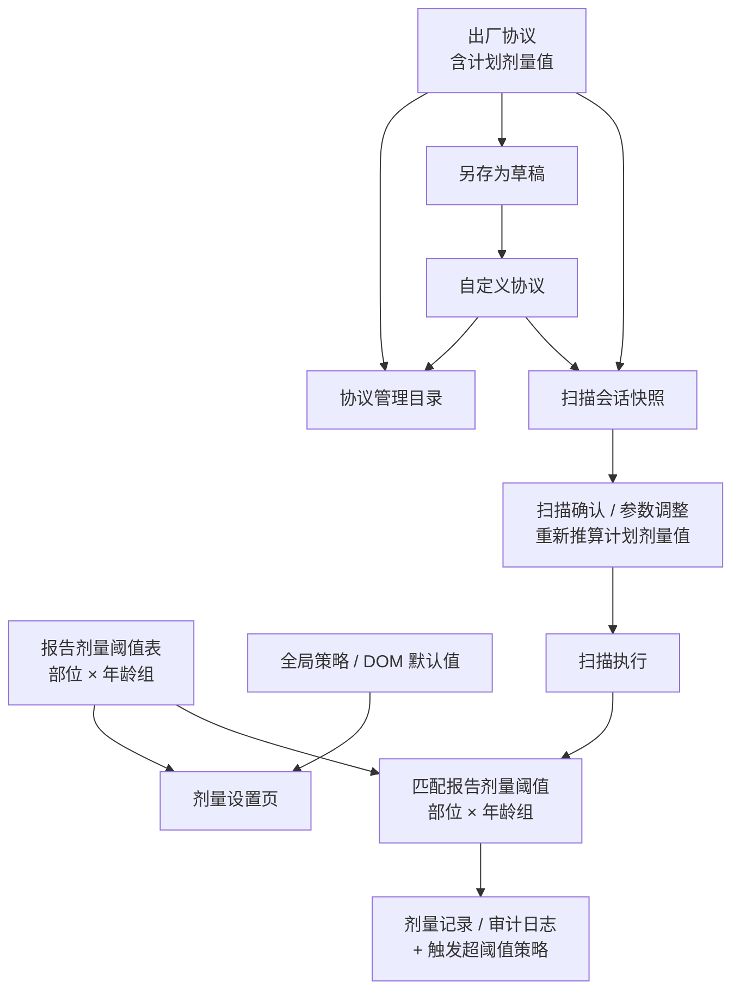

# 协议管理与剂量设置 PRD

版本：v0.4
日期：2026-05-25
状态：研发评审稿
适用范围：服务模式下的协议管理、协议编辑、剂量设置，以及扫描流程中的协议应用与剂量参数流转

## 1. 功能定位

协议管理与剂量设置用于维护 CT 控制台中的扫描协议模板，以及系统级的剂量参考值和 DOM 默认策略。

本期核心规则：

- 出厂协议是系统内置的基础协议，由产品在交付前预置。
- 协议管理同时展示出厂协议和自定义协议，构成协议目录。
- 出厂协议本期只允许查看和另存为，不允许修改、删除。
- 自定义协议本期允许查看、修改、删除。
- 出厂协议另存为：完整复制该出厂协议为新的自定义协议草稿，用户修改后保存。
- 系统级超阈值参考值（以下统称“报告剂量阈值”）按"部位 × 年龄组"维度维护，由剂量设置页统一管理。报告剂量阈值与单个协议无强绑定关系。
- 扫描流程从协议生成扫描会话快照，后续参数调整只影响本次检查。

## 2. 数据流总览

研发实现时优先按下表判断：页面读取哪里、保存到哪里、保存后影响谁。

| 功能 / 场景 | 页面数据来源 | 保存目标 | 保存后影响范围 |
| --- | --- | --- | --- |
| 协议管理列表 | 协议目录（出厂 + 自定义） | 无，仅展示和触发操作 | 不修改数据 |
| 查看出厂协议 | 选中的出厂协议 | 不允许保存 | 不修改数据 |
| 出厂协议另存为 | 选中出厂协议的完整副本 | 新自定义协议 | 后续新建扫描会话可使用新协议 |
| 新建自定义协议 | 用户选择的源协议结构 + 系统 DOM 默认值 | 新自定义协议 | 后续新建扫描会话可使用新协议 |
| 编辑自定义协议 | 选中的自定义协议 | 原自定义协议 | 只影响后续新建扫描会话，不影响已创建会话 |
| 删除自定义协议 | 选中的自定义协议 | 删除该协议 | 不删除历史扫描会话与剂量日志 |
| 剂量设置加载 | 系统报告剂量阈值表 + DOM 默认设置 | 无，仅展示和触发操作 | 不修改数据 |
| 剂量设置编辑保存 | 当前系统报告剂量阈值表和 DOM 默认设置 | 系统报告剂量阈值表 + DOM 默认设置 | 不自动覆盖既有协议和既有扫描会话 |
| 选择协议创建扫描 | 选中的出厂协议或自定义协议 | 新扫描会话快照 | 只影响本次检查 |
| 扫描确认页参数调整 | 当前扫描会话 | 当前扫描会话 | 只影响本次检查，不反写协议 |
| 扫描执行剂量记录 | 当前扫描会话 + 系统报告剂量阈值 + 超阈值处理策略 | 剂量记录 / 审计日志 | 绑定本次检查，不反写协议或系统阈值 |

## 3. 核心数据对象

### 3.1 出厂协议

出厂协议由产品在交付前预置，是协议管理目录、另存为和扫描会话生成的基础数据源。

出厂协议包含：

- 协议基础信息：协议名称、部位、年龄组、患者体位、床进方向、体重范围、采集方式、扫描模式、协议描述。
- 对比剂配置（增强扫描协议）。
- 扫描序列：定位片、螺旋、轴扫等序列结构及其参数。
- 扫描参数：kV、mA、层厚、间隔、Pitch、旋转时间、FOV、准直器、扫描方向等。
- DOM 参数：DOM 启用状态、DOM 噪声等级、mA 上限、mA 下限。
- 计划剂量值：根据当前扫描参数预估的 CTDIvol、DLP。
- 重建参数：重建算法、矩阵、层厚、间隔、窗宽、窗位等。

业务规则：

- 出厂协议本期只读。
- 出厂协议不允许直接修改。
- 出厂协议不允许删除。
- 出厂协议可以另存为自定义协议。
- 系统升级可更新出厂协议库，但不得自动覆盖用户已经保存的自定义协议和历史扫描会话。

### 3.2 自定义协议

自定义协议是用户可维护的协议。

来源：

- 从出厂协议另存为。
- 从已有自定义协议另存为。
- 修改并保存已有自定义协议。

业务规则：

- 自定义协议可以查看。
- 自定义协议可以修改。
- 自定义协议可以删除。
- 修改自定义协议只影响后续新建扫描会话。
- 删除自定义协议不删除历史扫描会话和剂量日志。
- 本期 UI 不提供协议启用 / 停用入口，所有未删除的自定义协议视为可用。

### 3.3 计划剂量值

计划剂量值是协议或扫描会话在当前扫描参数下的预估剂量值，用于让技师理解参数调整对剂量的影响。

来源：

- 出厂协议预置计划剂量值。
- 自定义协议从源协议复制计划剂量值。
- 用户修改扫描参数后，系统重新推算计划剂量值。
- 扫描会话中修改参数后，本次检查的计划剂量值也随之更新。

用途：

- 展示当前协议或当前检查的预计执行剂量。
- 帮助技师理解参数调整对剂量的影响。
- **不**作为超阈值判断的基准。

### 3.4 报告剂量阈值（系统级）

报告剂量阈值是用于超阈值判断的剂量参考值。本期采用"部位 × 年龄组"维度集中维护，不绑定到具体协议。

每条阈值记录包含：

- 部位。
- 年龄组。
- 报告 CTDIvol 阈值。
- 报告 DLP 阈值。

业务规则：

- 报告剂量阈值由剂量设置页统一维护。
- 同一"部位 × 年龄组"在阈值表中唯一。
- 报告剂量阈值不随用户调整扫描参数自动变化。
- 报告剂量阈值不随出厂协议升级而自动覆盖用户已编辑的值。
- 当前检查在执行或确认阶段，按扫描会话的"部位 × 年龄组"匹配对应的报告剂量阈值；若无匹配条目，则本次检查不触发超阈值判断。

计划剂量值与报告剂量阈值的区别：

| 类型 | 维护位置 | 是否随扫描参数变化 | 用途 |
| --- | --- | --- | --- |
| 计划剂量值 | 协议 / 扫描会话内部 | 是 | 展示预计执行剂量 |
| 报告剂量阈值 | 剂量设置页（部位 × 年龄组） | 否 | 判断当前检查是否超阈值 |

### 3.5 系统剂量设置

系统剂量设置是服务模式下维护的全局策略，由两部分组成：

1. 报告剂量阈值表：见 3.4。
2. 全局策略与默认值：
   - 超阈值处理策略：仅记录 / 弹窗警告 / 强制二次确认。
   - DOM 默认启用状态。
   - DOM 默认噪声等级。
   - 超阈值审计开关。

业务规则：

- 修改系统剂量设置不自动覆盖既有自定义协议。
- 修改系统剂量设置不自动覆盖既有扫描会话。
- 新建自定义协议或扫描会话时，可将当前 DOM 默认值写入协议草稿，作为初始值。

### 3.6 扫描会话

扫描会话是一次具体检查的参数快照。

来源：

- 用户在扫描流程中选择某个出厂协议或自定义协议。
- 系统复制该协议的完整数据，生成扫描会话。

扫描会话包含：

- 协议基础信息。
- 扫描序列和扫描参数。
- DOM 参数。
- 计划剂量值。
- 对比剂配置（如适用）。
- 重建参数。

业务规则：

- 扫描会话创建后，与源协议解耦。
- 修改扫描会话只影响本次检查。
- 修改源协议不影响已经创建的扫描会话。
- 扫描会话本身不锁定报告剂量阈值快照；超阈值判断在执行时按"部位 × 年龄组"实时匹配系统报告剂量阈值表（是否在会话中固化阈值，列入待产品确认）。
- 扫描完成后，会话参数和剂量记录作为检查历史保存。

### 3.7 剂量记录

剂量记录是扫描执行后的结果数据，用于剂量日志展示与超阈值审计。

剂量记录包含：

- 患者快照（姓名、ID）。
- 协议名快照。
- 部位、采集方式、扫描模式、序列标签等扫描上下文。
- 执行剂量值：CTDIvol、DLP。
- 关键扫描参数：kV、mA、旋转时间、Pitch（仅螺旋）、扫描长度、准直器。
- 是否超阈值标记、确认人和确认时间（如适用）。

业务规则：

- 剂量记录在生成时冻结上述快照字段，即使后续协议、会话或患者被删除，记录仍可读。
- 剂量记录不反写协议。
- 剂量记录不反写系统报告剂量阈值。
- 若当前检查剂量达到或超过命中的报告剂量阈值，则按系统超阈值处理策略执行。

## 4. 总体数据流

数据流规则：

1. 出厂协议是基础源，不被用户直接修改。
2. 出厂协议另存为时，完整复制出厂协议为草稿，用户修改后保存为新的自定义协议。
3. 报告剂量阈值在剂量设置页独立维护，不读取协议内部的剂量字段。
4. 计划剂量值由扫描参数推算，可随参数变化更新。
5. 报告剂量阈值作为超阈值判断基准，不因用户调整扫描参数自动变化。
6. 扫描执行只读取扫描会话；超阈值判断按"部位 × 年龄组"匹配系统报告剂量阈值。
7. 剂量记录只绑定扫描会话，不回写协议或系统阈值。

## 5. 协议管理功能

### 5.1 功能入口

入口：服务模式 / 协议管理。

### 5.2 数据源

协议管理页面读取协议目录，目录中包含出厂协议和未删除的自定义协议。

每条协议在列表中至少展示：

- 协议名称。
- 来源：出厂 / 自定义。
- 部位。
- 年龄组。
- 采集方式。
- 扫描模式。
- 更新时间。

本期不展示启用 / 停用状态。

### 5.3 列表筛选

协议管理应支持：

- 按来源筛选：全部、出厂、自定义。
- 按部位筛选。
- 按年龄组筛选。
- 按采集方式筛选。
- 按扫描模式筛选。
- 按协议名称搜索。
- 按名称或更新时间排序。

筛选只影响当前列表展示，不改变协议数据。

UI 布局遵循服务模式约定：列表 + 筛选页使用单外框 + 横线分割，不要在内部再嵌套圆角块。

### 5.4 协议操作

| 操作 | 出厂协议 | 自定义协议 |
| --- | --- | --- |
| 查看 | 支持 | 支持 |
| 修改 | 不支持 | 支持 |
| 另存为 | 支持 | 支持 |
| 删除 | 不支持 | 支持 |
| 启用 / 停用 | 本期不支持 | 本期不支持 |

操作规则：

- 点击查看出厂协议，进入只读协议编辑页面。
- 点击出厂协议另存为，系统完整复制该出厂协议生成草稿，用户可修改部分参数后保存为新的自定义协议。
- 点击修改自定义协议，进入协议编辑页面，草稿数据来自该自定义协议。
- 点击自定义协议另存为，完整复制该自定义协议生成草稿，保存后生成新的自定义协议。
- 点击删除自定义协议前需要二次确认。
- 删除自定义协议后不影响历史扫描会话与剂量日志。

## 6. 协议编辑功能

### 6.1 功能入口

协议编辑页面由以下入口进入：

- 协议管理 / 查看出厂协议。
- 协议管理 / 出厂协议另存为。
- 协议管理 / 新建自定义协议。
- 协议管理 / 修改自定义协议。
- 协议管理 / 自定义协议另存为。

### 6.2 页面数据源

协议编辑页面所有数据都来自"协议编辑草稿"。

草稿初始化规则：

| 入口 | 草稿来源 | 页面状态 | 保存目标 |
| --- | --- | --- | --- |
| 查看出厂协议 | 选中的出厂协议 | 只读 | 不允许保存 |
| 出厂协议另存为 | 选中出厂协议的完整副本 | 可编辑 | 新自定义协议 |
| 新建自定义协议 | 用户选择的源协议结构 | 可编辑 | 新自定义协议 |
| 修改自定义协议 | 选中的自定义协议 | 可编辑 | 原自定义协议 |
| 自定义协议另存为 | 选中自定义协议的完整副本 | 可编辑 | 新自定义协议 |

### 6.3 页面结构

协议编辑页面包含：

- 基础信息。
- 序列列表。
- 扫描参数。
- DOM 参数。
- 计划剂量值。
- 重建参数。

### 6.4 基础信息

字段：

- 协议名称。
- 部位。
- 年龄组。
- 患者体位。
- 床进方向。
- 体重范围。
- 采集方式。
- 扫描模式。
- 协议描述。

规则：

- 协议名称、部位、年龄组必填。
- 出厂协议只读。
- 另存为时协议名称默认追加"副本"，用户可修改。
- 本期不提供启用、停用字段。

### 6.5 扫描参数

协议包含一个或多个扫描序列。每个序列包含序列类型和对应参数。

序列类型：

- 定位片。
- 螺旋扫描。
- 轴扫。

通用字段：

- 序列名称。
- 序列类型。
- kV。
- mA。
- FOV。
- 计划 CTDIvol。
- 计划 DLP。

螺旋 / 轴扫额外字段：

- 层厚。
- 间隔（轴扫）。
- Pitch（螺旋）。
- 旋转时间。
- 准直器。
- 扫描方向。
- DOM 启用状态。
- DOM 噪声等级。
- mA 上限。
- mA 下限。

规则：

- 出厂协议序列只读。
- 自定义协议序列可编辑。
- 用户修改影响剂量的扫描参数后，系统应重新推算计划 CTDIvol 和计划 DLP。
- 协议内部不存储报告剂量阈值字段；超阈值判断由剂量设置页维护的报告剂量阈值表提供。

### 6.6 DOM 参数

DOM 是 XYZ 三轴电流调制。系统中不展示 AEC 概念。

字段：

- DOM 启用状态。
- DOM 噪声等级：低、中、高。
- mA 上限。
- mA 下限。

数据来源：

- 出厂协议查看：来自出厂协议。
- 出厂协议另存为：来自出厂协议完整副本。
- 新建自定义协议：来自源协议；如源协议未提供，回退到系统 DOM 默认设置。
- 修改自定义协议：来自自定义协议。
- 扫描会话：来自会话快照。

规则：

- DOM 噪声等级固定为低、中、高三级。
- DOM 关闭时，mA 上下限可以保留为草稿值，但执行时不启用 DOM 调制。
- mA 下限不得大于 mA 上限。
- 页面不得出现 AEC、自动曝光控制、动态器官剂量调制、器官剂量保护等文案。

### 6.7 计划剂量值

字段：

- 计划 CTDIvol。
- 计划 DLP。

来源：

- 初始来自源协议。
- 用户修改扫描参数后重新推算。

用途：

- 展示该协议或当前草稿预计执行时的剂量。
- 写入扫描会话快照供扫描确认页参考。
- **不**作为超阈值判断基准。

规则：

- 计划 CTDIvol 和计划 DLP 不得为负数。
- 协议内部不展示也不存储"报告剂量值"；如产品后续需要让用户在协议层覆盖报告剂量阈值，由"待产品确认"项决定。

### 6.8 另存为流程

出厂协议另存为用于快速创建自定义协议。

流程：

1. 用户在协议管理列表选择某个出厂协议。
2. 点击另存为。
3. 系统完整复制该出厂协议，生成可编辑草稿。
4. 用户修改协议名称、扫描参数、DOM 参数、计划剂量值或重建参数。
5. 用户保存。
6. 系统创建新的自定义协议。
7. 原出厂协议不发生任何变化。

自定义协议另存为同理：完整复制源自定义协议为草稿，保存后生成新的自定义协议，源协议不变化。

### 6.9 保存规则

保存目标由页面模式决定：

| 页面模式 | 保存行为 |
| --- | --- |
| 查看出厂协议 | 不允许保存 |
| 出厂协议另存为 | 创建新的自定义协议 |
| 新建自定义协议 | 创建新的自定义协议 |
| 修改自定义协议 | 更新当前自定义协议 |
| 自定义协议另存为 | 创建新的自定义协议 |

保存内容：

- 基础信息。
- 对比剂配置（若为增强协议）。
- 序列结构。
- 扫描参数。
- DOM 参数。
- 计划剂量值。
- 重建参数。

保存成功后：

- 返回协议管理列表或停留当前详情页并刷新数据。
- 协议管理列表显示最新更新时间。

## 7. 剂量设置功能

### 7.1 功能入口

入口：服务模式 / 剂量设置。

UI 布局遵循服务模式约定：单外框 + 横线分割，顶部栏样式与扫描模式保持一致，不要擅自改参数条样式。

### 7.2 页面数据源

剂量设置页面由两部分组成：

1. 报告剂量阈值表：按"部位 × 年龄组"维护的剂量参考值集合。
2. 全局策略与 DOM 默认设置：超阈值处理策略、DOM 默认启用状态、DOM 默认噪声等级、超阈值审计开关。

加载规则：

- 首次进入时，若报告剂量阈值表为空，由产品确认是否使用预置数据填充，或由用户在剂量设置页手工录入。
- 报告剂量阈值表一旦初始化，即作为系统超阈值判断的唯一来源，不再从协议内部读取剂量字段。

### 7.3 报告剂量阈值表

字段：

- 部位。
- 年龄组。
- 报告 CTDIvol 阈值。
- 报告 DLP 阈值。

规则：

- 同一"部位 × 年龄组"在表中唯一，重复将提示冲突。
- 报告剂量阈值不得为负数。
- 年龄组沿用产品统一口径：成人、儿童、婴幼儿。
- 用户可新增、修改、删除某一"部位 × 年龄组"的阈值。
- 删除某条阈值后，对应"部位 × 年龄组"的检查在执行时不再触发超阈值判断，直至该条目被重新添加。

### 7.4 超阈值处理策略

可选策略：

- 仅记录：超过阈值时写入剂量日志，不阻断流程。
- 弹窗警告：超过阈值时提示用户确认。
- 强制二次确认：超过阈值时要求二次确认，并记录确认信息。

判断逻辑：

1. 当前检查取扫描会话的"部位 × 年龄组"，匹配报告剂量阈值表。
2. 若无匹配条目，则不触发超阈值判断（视为本类检查暂未设定参考值）。
3. 用户修改扫描参数后，系统重新推算当前检查计划剂量值。
4. 若计划剂量值或实际执行剂量值达到 / 超过命中的报告剂量阈值，则判定为超阈值检查。
5. 判定超阈值后，按系统超阈值处理策略执行；如审计开关打开，需要在剂量日志或审计日志中记录。

### 7.5 DOM 默认设置

字段：

- 启用 DOM。
- DOM 噪声等级：低、中、高。

数据流：

- 新建自定义协议时，若源协议未提供 DOM 设置，使用系统 DOM 默认设置写入协议草稿。
- 从出厂协议另存为时，优先使用出厂协议中的 DOM 设置。
- 修改已有自定义协议时，优先使用协议自身 DOM 设置。
- 扫描会话创建后，使用协议中的 DOM 设置生成会话快照。

规则：

- 修改系统 DOM 默认设置不自动覆盖已有自定义协议。
- 修改系统 DOM 默认设置不自动覆盖已有扫描会话。
- 扫描确认页修改 DOM 时，只更新当前扫描会话。

### 7.6 保存规则

保存内容：

- 报告剂量阈值表。
- 超阈值处理策略。
- DOM 默认设置。
- 超阈值审计开关。

保存成功后：

- 新建协议可使用最新 DOM 默认值作为草稿初始值。
- 新建扫描会话仍从协议中复制 DOM 与剂量字段。
- 既有自定义协议和既有扫描会话保持不变，除非用户进入对应对象手动修改。

## 8. 扫描流程中的协议应用

### 8.1 选择协议

入口：患者检查流程 / 协议选择。

数据源：

- 出厂协议。
- 未删除的自定义协议。

本期没有启用 / 停用逻辑，因此协议选择列表展示所有可用的出厂协议和未删除的自定义协议。

### 8.2 创建扫描会话

用户选择协议后，系统创建扫描会话。

复制内容：

- 协议基础信息。
- 所有扫描序列。
- 所有扫描参数。
- DOM 启用状态、DOM 噪声等级、mA 上下限。
- 计划 CTDIvol、计划 DLP。
- 对比剂配置（如适用）。
- 重建参数。

规则：

- 扫描会话必须是协议的完整快照。
- 扫描会话创建后不再依赖源协议实时读取参数。
- 源协议更新不影响已创建会话。

### 8.3 参数确认与临时调整

扫描确认页读取扫描会话。

可调整内容：

- 当前扫描序列参数。
- DOM 启用状态。
- DOM 噪声等级。
- mA 上下限。

规则：

- 调整只保存到扫描会话。
- 不反写协议。
- 页面应提示"修改仅影响本次检查"。
- DOM 噪声等级与剂量设置页保持一致，只显示低、中、高。
- 调整扫描参数后，重新推算当前检查计划剂量值。
- 重新推算后的计划剂量值达到或超过命中的报告剂量阈值时，标记为超阈值检查。

### 8.4 扫描执行与剂量记录

扫描执行读取扫描会话。

执行过程中：

- 使用扫描会话中的采集参数和 DOM 参数。
- 按扫描会话"部位 × 年龄组"匹配系统报告剂量阈值表进行超阈值判断。
- 超阈值处理策略来自系统剂量设置。
- 生成剂量记录并绑定扫描会话。

执行后：

- 剂量记录进入剂量日志。
- 剂量记录不修改系统报告剂量阈值。
- 剂量记录不修改协议。

## 9. 年龄组与命名规范

### 9.1 年龄组

产品展示统一为：

- 成人。
- 儿童。
- 婴幼儿。

兼容规则：

- 历史数据中可能存在不同的英文枚举写法，UI 统一映射为上述三档展示。
- 协议年龄组与报告剂量阈值年龄组之间必须可一一对应；若产品后续引入新的年龄分档，需同时更新协议表单和剂量设置表单。

### 9.2 DOM 命名

用户界面统一使用 DOM。

禁止展示：

- AEC。
- 自动曝光控制。
- 动态器官剂量调制。
- 器官剂量保护。

推荐展示：

- DOM 三轴电流调制。
- 启用 DOM。
- DOM 噪声等级。
- mA 上限。
- mA 下限。

## 10. 校验规则

### 10.1 协议校验

- 协议名称必填。
- 部位必填。
- 年龄组必填。
- 至少包含一个扫描序列。
- 每个扫描序列必须有合法类型。
- 增强协议必须配置对比剂参数。
- 自定义协议不允许同名，建议同部位下提示重名风险。

### 10.2 参数校验

- 数值参数必须在临床合理范围内（参见 `docs/CT_DOMAIN_CONTEXT.md` 中的原型范围）。
- 计划 CTDIvol、计划 DLP 不得为负数。
- 报告 CTDIvol 阈值、报告 DLP 阈值不得为负数。
- mA 下限不得大于 mA 上限。
- DOM 噪声等级只能为低、中、高。
- 报告剂量阈值表中"部位 × 年龄组"不可重复。

### 10.3 保存校验

- 出厂协议不可保存。
- 自定义协议保存失败时，页面保留草稿并提示失败原因。
- 剂量设置保存失败时，不更新本地已保存状态。
- 扫描会话保存失败时，不进入下一步扫描执行。

## 11. 验收标准

1. 协议管理列表可同时展示出厂协议和自定义协议，并能按来源筛选。
2. 出厂协议只能查看和另存为，不能修改或删除。
3. 自定义协议可以查看、修改和删除。
4. 本期协议管理 UI 不出现启用、停用功能。
5. 出厂协议另存为时，协议编辑页所有字段均来自选中的出厂协议完整副本。
6. 用户修改另存为草稿后保存，系统创建新的自定义协议，原出厂协议不变化。
7. 协议编辑页展示计划剂量值（计划 CTDIvol、计划 DLP），不出现"报告剂量值"列。
8. 用户修改扫描参数后，计划剂量值重新推算。
9. 剂量设置页可维护按"部位 × 年龄组"的报告剂量阈值表，不依赖协议内部剂量字段。
10. 报告剂量阈值表中同一"部位 × 年龄组"唯一，重复输入需提示冲突。
11. 当前检查修改扫描参数后，若计划或实际执行剂量值达到 / 超过命中的报告剂量阈值，则判定为超阈值检查，并按系统超阈值处理策略执行。
12. 报告剂量阈值表中无对应"部位 × 年龄组"条目时，本次检查不触发超阈值判断。
13. 修改系统剂量设置不自动覆盖既有自定义协议与既有扫描会话。
14. 修改协议不影响已经创建的扫描会话。
15. 创建扫描会话时，完整复制协议中的扫描参数、DOM 参数、计划剂量值、对比剂配置和重建参数。
16. 扫描确认页修改参数只影响当前扫描会话，不反写协议。
17. 扫描执行生成剂量记录，记录绑定扫描会话，不反写协议或系统报告剂量阈值。
18. 所有用户可见页面均不出现 AEC 文案。
19. DOM 噪声等级在剂量设置、协议编辑、扫描确认页均为低、中、高三级。
