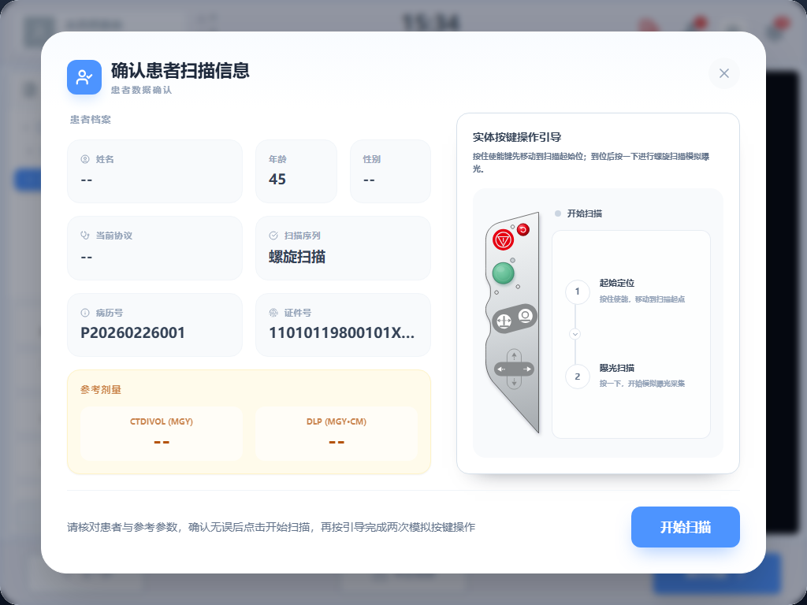
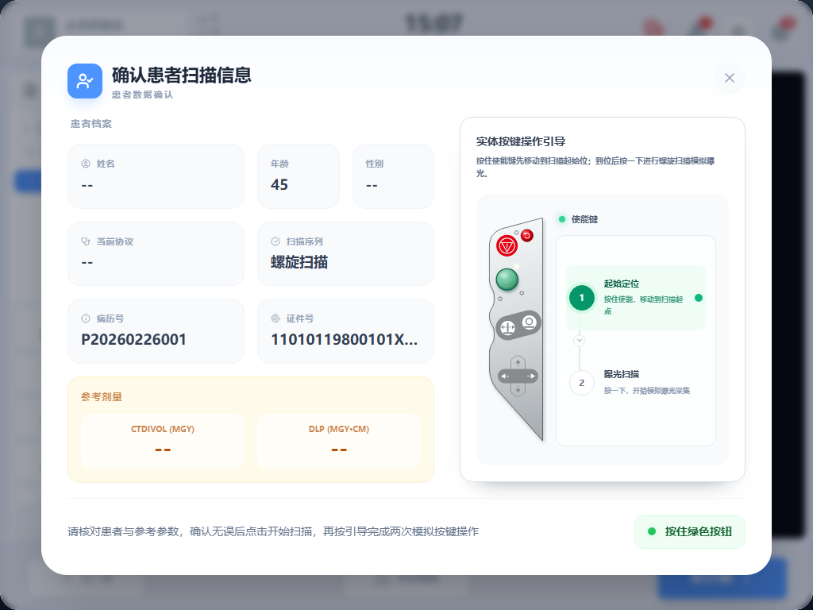

# 模拟物理按键生产实现交接说明

> 文档状态：按当前 WT32 原型确认，可供研发拆分生产实现。
> 产品边界：WT32 是 CT 控制台交互原型，不直接控制真实设备。本文中的定位、曝光、剂量和安全状态均为界面与接口约定；生产环境必须以设备控制系统的确认事件为准。参考剂量仅用于确认，不能视为最终剂量计算或审批结果。

## 1. 本次调整结论

模拟物理按键不再作为患者确认后的独立弹层出现，而是与以下信息合并在同一确认弹窗中：

- 患者信息；
- 当前协议和扫描序列；
- CTDIvol、DLP 参考值；
- 模拟物理控制面板；
- “起始定位 → 曝光扫描”两步引导。

弹窗刚出现时，模拟按键不可操作。操作员点击“开始扫描”后才激活第一步；到达扫描起始位后切换到第二步；扫描请求被设备端接受后关闭整个合并弹窗，并进入扫描执行界面。

生产实现应保持这一信息层级和操作顺序，不要恢复成“患者确认弹窗 + 单独按键弹窗”两个连续弹层。

## 2. UI 截图与 SVG 资产

以下截图均来自 1024 × 768 控制台画布。研发应以截图确定弹窗结构、相对位置、颜色层级和状态表达，以 SVG 确定物理控制面板的轮廓与图形细节。

**状态一：合并确认蒙层刚出现。** 模拟按键尚未激活，两个步骤均为待开始状态，右下角显示蓝色“开始扫描”按钮。

**状态二：点击“开始扫描”后。** 第一项“起始定位”变为激活状态，右下角按钮替换为绿色操作提示。

交付资产：

- 控制面板 SVG：[physical-control-panel.svg](../ui-review/src/assets/physical-control-panel.svg)
- 当前 SVG 状态封装参考：[PhysicalControlPanelSvg.tsx](../ui-review/src/components/PhysicalControlPanelSvg.tsx)
- 当前合并弹窗参考：[ScanConfirmScreen.tsx](../ui-review/src/screens/ScanConfirmScreen.tsx)
- 当前两步流程参考：[HelicalExecuteScanScreen.tsx](../ui-review/src/screens/HelicalExecuteScanScreen.tsx)

### 2.1 视觉与交互要点

- 弹窗左侧展示患者、协议、序列和参考剂量，右侧展示物理控制面板和两步状态。
- 弹窗首次出现时，两步均为未激活状态，按键和指示灯置灰；底部仅显示“开始扫描”。
- 点击“开始扫描”后，底部改为绿色状态提示，第一步使用绿色底色、绿色编号和动态状态点强调。
- 第一步完成后，第一步显示完成标记，第二步切换为激活状态。
- 绿色按钮是本流程唯一可点击区域。红色按钮和“急停”文字仅用于还原参考外观，不得在此原型控件中实现真实急停逻辑，也不能让界面暗示已经具备真实安全控制能力。
- 绿色按钮触控热区不得小于 44 × 44 px；触控、鼠标和键盘操作必须共用同一状态机。
- 按下态通过按钮下沉、颜色加深和指示灯变化表达；禁用态必须同时取消事件响应和视觉强调，不能只降低透明度。

## 3. 从出现到关闭的完整流程

### 3.1 出现条件

仅在以下条件同时成立时，点击执行页右下角“执行扫描”才显示合并弹窗：

1. 当前扫描会话和待执行序列已确定；
2. 当前不在定位、下发、曝光、暂停、重建或完成状态；
3. 没有阻断性设备异常；
4. 没有尚未确认结果的上一笔定位或扫描请求。

弹窗出现后先展示信息，但不立即开放模拟按键。操作员需核对患者、扫描序列及参考剂量，再点击“开始扫描”。

### 3.2 第一步：按住移动至扫描起始位

1. 点击“开始扫描”后，第一步“起始定位”变为激活状态，绿色按键可用。
2. 操作员按下并持续按住绿色按键，前端发送定位开始意图，界面进入“定位中”。
3. 操作员在设备到位前松开、触控取消或指针捕获丢失时，前端必须发送停止移动意图；收到停止确认后回到第一步可重试状态，合并弹窗保持打开。
4. 只有收到设备端“已到扫描起始位”的明确确认事件，才可将第一步标记为完成并激活第二步。
5. 原型中的按住时长和进度动画只能用于演示，生产环境不得把“按够了某个时长”当作设备已到位。

### 3.3 第二步：按下并请求扫描

1. 设备确认到位后，第二步“曝光扫描”变为激活状态。
2. 操作员再次按下绿色按键，前端只生成一笔扫描开始请求，并立即进入请求中锁定状态。
3. 请求中禁止重复点击、第二指针、键盘重复触发和再次下发。
4. 收到设备端“扫描请求已接受”后，关闭整个合并弹窗，进入扫描执行界面。
5. “请求已接受”不等于“已经曝光”。执行界面仍须根据设备端后续的曝光开始、曝光结束、重建等事件更新状态。

### 3.4 正常关闭规则

| 场景 | 是否关闭弹窗 | 关闭后的状态 |
| --- | --- | --- |
| 未点击“开始扫描”时点击右上角关闭 | 是 | 回到执行页待开始状态 |
| 第一步提前松开或触控取消 | 否 | 停止移动，回到第一步可重试状态 |
| 第一步到位 | 否 | 第一步完成，第二步激活 |
| 第二步扫描请求被接受 | 是 | 进入扫描执行状态 |
| 扫描请求拒绝、失败或超时 | 是 | 显示流程错误，允许重新尝试或返回确认 |
| 阻断性设备异常 | 是 | 进入全局设备异常处理，不保留可操作按键 |

若操作员在“定位中”点击关闭，生产实现必须先发停止移动请求并完成状态收敛，再关闭弹窗；不能只关闭 UI 而让设备动作继续。

## 4. 状态机

建议生产实现以单一状态机驱动 UI、按钮可用性和设备命令，避免由多个布尔值拼接出互相矛盾的画面。

| 状态 | UI 表现 | 允许输入 | 退出条件 |
| --- | --- | --- | --- |
| `closed` | 弹窗不可见 | 执行扫描 | 满足出现条件后进入 `confirming` |
| `confirming` | 弹窗可见，按键置灰，两步未激活 | 开始扫描、关闭 | 开始扫描 → `position_ready`；关闭 → `closed` |
| `position_ready` | 第一步激活 | 按住绿色键、关闭 | 按下 → `positioning` |
| `positioning` | 绿色键按下态，提示持续按住 | 松开、取消、关闭 | 到位 → `positioned`；松开/取消 → `position_ready`；异常 → `failed` |
| `positioned` | 第一步完成，第二步激活 | 再次按下、关闭 | 按下 → `scan_requesting` |
| `scan_requesting` | 第二步请求中，全部触发入口锁定 | 无重复下发 | 接受 → `closed/executing`；失败 → `failed` |
| `failed` | 按键弹窗已关闭，显示单一错误层 | 重新尝试、返回确认 | 重试 → `confirming`；返回 → 上一级确认页 |

状态切换必须由事件驱动。设备回包、页面关闭和超时回调在处理前都要校验当前会话、命令标识和当前状态。

## 5. 设备事件与接口契约

以下名称是语义约定，研发可按生产系统命名，但信息不能缺失。

### 5.1 UI 发往设备控制层

- `POSITION_START`：开始向扫描起始位移动；携带 `scan_session_id`、`series_id`、`command_id`。
- `POSITION_STOP`：因松开、取消、关闭或异常请求停止；携带原 `command_id` 和停止原因。
- `SCAN_START_REQUEST`：请求开始当前序列；携带 `scan_session_id`、`series_id`、新的 `command_id`。

### 5.2 设备控制层返回 UI

- `POSITION_STARTED`：设备接受定位移动请求。
- `POSITION_STOPPED`：设备已停止；应包含当前位置或是否到位。
- `POSITION_REACHED`：设备已确认到达扫描起始位。
- `SCAN_ACCEPTED`：扫描开始请求已被接受。
- `SCAN_REJECTED`：请求被拒绝；包含可展示原因和可否重试标识。
- `DEVICE_ERROR`：包含错误码、严重度、是否阻断、所属会话及建议动作。

### 5.3 必须遵守的接口规则

- 每笔命令使用唯一 `command_id`，回包必须原样关联；迟到的旧回包不得推进当前流程。
- `SCAN_START_REQUEST` 必须幂等。网络重试不能创建第二次扫描任务。
- UI 超时只表示“规定时间内未确认”，不能自行推断设备没有移动或没有开始扫描。
- 发生超时或断线后，重新尝试前必须先查询设备/会话真实状态；状态未知时禁止直接再次下发。
- 页面卸载、路由切换和组件销毁必须取消本地定时器、动画与订阅；若仍处于移动中，还必须触发生产系统定义的停止/接管流程。

## 6. 异常处理

### 6.1 第一步提前松开、触控取消或键盘抬起

- 立即结束按下态并请求停止移动。
- 合并弹窗不关闭，第一步恢复为可重试。
- `pointercancel`、`lostpointercapture`、鼠标/触控抬起和 Space/Enter 抬起均按同一规则处理。
- 同一时刻只接受一个活动指针；第二指针和键盘长按重复事件应被忽略。

### 6.2 定位超时

- 取消当前定位等待和动画，锁定模拟按键。
- 请求停止移动，并查询设备当前位置与会话状态。
- 关闭合并弹窗，显示“定位移动超时/状态待确认”的流程错误。
- “重新尝试”必须从患者信息与第一步重新开始；不得直接跳到第二步。

### 6.3 扫描下发拒绝、失败或超时

- 关闭合并弹窗，清除本地按下态和请求中状态。
- 显示一个流程错误层，提供“重新尝试”和“返回确认”。
- 重新尝试前先查询会话真实状态；若设备已经接受旧请求，应转入执行状态，不能再发一笔扫描。
- 迟到的旧请求结果只用于状态对账，不得重复关闭弹窗、重复导航或再次触发曝光。

### 6.4 设备异常

- `warning` 且设备明确标记为非阻断时，可保留当前流程，但应在统一设备提示区展示；前端不得仅根据文案猜测是否阻断。
- 阻断性异常且属于当前扫描会话时，立即锁定按键、停止/取消未完成动作并关闭合并弹窗。
- 设备异常使用全局设备异常组件，不能再叠加一张流程错误弹窗；用户一次只处理一个主错误层。
- 与当前 `scan_session_id` 无关的异常不得错误地重置本流程，但仍可由全局异常中心按系统规则展示。
- 异常解除后从确认页重新进入，不直接恢复到异常前的按键步骤。

### 6.5 用户关闭、返回或切换页面

- `confirming`、`position_ready`、`positioned` 可关闭并重置为初始状态。
- `positioning` 必须先停止移动并确认状态收敛。
- `scan_requesting` 不允许静默关闭；应先确认请求结果，或进入“状态未知、等待确认”的异常处理。
- 扫描请求已接受后，返回和关闭入口由执行流程统一管理，不能重新打开模拟按键并再次下发。

## 7. 验收清单

研发至少覆盖以下验收场景：

1. 点击“执行扫描”后出现合并弹窗，模拟按键默认不可用。
2. 点击“开始扫描”后只激活第一步，患者、序列和参考剂量仍保持可见。
3. 第一步按住后移动；提前松开、移出控件、触控取消或失去指针捕获均停止并可重试。
4. 未收到 `POSITION_REACHED` 时，无论按住多久都不能进入第二步。
5. 到位后第一步显示完成，第二步激活；第二次按下只生成一个扫描请求。
6. `SCAN_ACCEPTED` 后合并弹窗关闭，执行页依据后续设备事件更新曝光与重建状态。
7. 定位超时、扫描拒绝、网络断开和迟到回包均不会造成重复命令或错误跳步。
8. 阻断性设备异常关闭按键界面，且不与流程错误弹窗叠加。
9. 关闭弹窗或切换页面时不存在残留定时器、残留按下态或继续移动。
10. 1024 × 768 分辨率下弹窗不裁切，绿色按钮触控热区不小于 44 × 44 px，SVG 不拉伸变形。

## 8. 生产实现范围与非目标

本交接要求实现的是 UI、状态机、事件关联、异常收敛和视觉一致性。以下内容不由该模拟控件自行决定：

- 真实设备运动控制算法和安全回路；
- 真实急停逻辑；
- 曝光许可、剂量审批或最终剂量计算；
- 设备端超时阈值、互锁条件和故障恢复策略。

这些能力必须由设备控制与安全系统提供，并通过明确事件反馈给 UI；前端只展示已确认状态，不替代真实设备确认。
